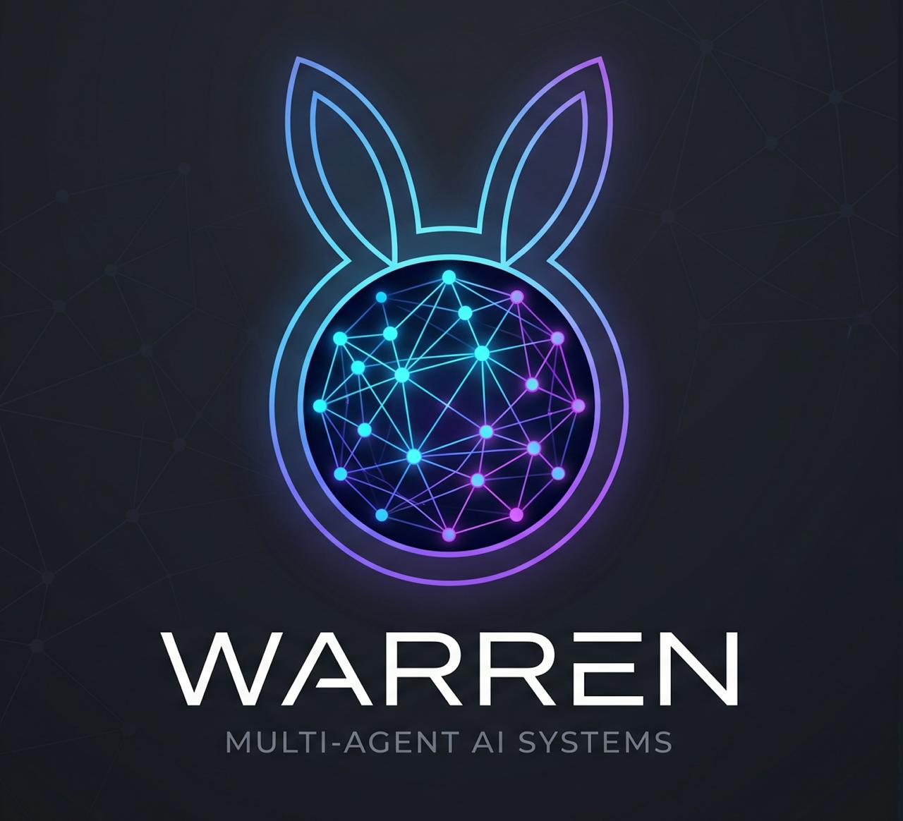

<div align="center">



# warren

**A self-hosted warren of always-on Claude Code agents that build and maintain your personal knowledge base — running on your subscription, not the metered API.**

</div>

A *warren* is a network of connected burrows. Here it's a network of connected
agents: one orchestrator routes work to specialized domain agents, each living in
its own folder, each maintaining its own corner of a shared, interlinked markdown
knowledge base. They talk to each other over a file-based bus, you reach them from
your phone, and they keep the whole thing organized while you sleep.

You clone this repo, talk to an agent once, and it builds a personalized warren for
you — your orchestrator name, your domains, your schedule.

---

## Why this is different

Most "agent frameworks" on top of Claude (OpenClaw, Harness, and friends) drive it
through `claude -p` — **one-shot, headless, through the API**. That means **you pay
per token**, sessions are ephemeral, and there's no persistent agent to talk to.

**warren does the opposite.** Agents run as **long-lived interactive `claude`
sessions inside tmux**. That means:

| | API frameworks (`claude -p`) | **warren** |
|---|---|---|
| Billing | Pay per token (API) | **Flat subscription** (Pro/Max) |
| Lifetime | Ephemeral one-shot calls | **Persistent, always-on** |
| Mobile | — | **Remote Control from your phone** |
| State | Stateless | **Warm context, living memory** |
| Cost at scale | Grows with usage | **Fixed** |

If you already pay for a Claude subscription, warren turns it into a 24/7 multi-agent
operating system at **no extra cost per token**.

---

## What you get

- **One orchestrator + N domain agents.** The orchestrator routes; domains specialize
  (finance, health, journaling, tasks, coding — whatever you define).
- **An LLM-maintained wiki.** Agents incrementally build and cross-reference a markdown
  knowledge base. Not RAG — a *compounding* artifact that gets richer over time.
- **A file-based message bus.** Agents message each other autonomously when something
  crosses domains. No queues, no network, no database.
- **Remote Control.** Drive every agent from the Claude mobile app or claude.ai.
- **Telegram notifications.** Daily digests, alerts, and live bus traffic to your phone.
- **Scheduled work.** Cron-driven agents that wake up, do a job, and report — without
  ever touching the metered API.
- **Runs on macOS and Linux** (your laptop, a Mac Mini, or a VPS).

---

## Quickstart

```bash
git clone https://github.com/serhiizghama/warren
cd warren
claude            # start Claude Code in this folder
```

Then tell the agent:

> **read BOOTSTRAP.md and set up my warren**

It will interview you (orchestrator name, domains, Telegram, schedule), check your
dependencies, scaffold your private `vault/`, and bring the network online. One flow,
no manual script editing.

See **[ARCHITECTURE.md](ARCHITECTURE.md)** for the full technical design and
**[docs/](docs/)** for guides.

---

## Talking to your agents

Your agents run as live sessions on your machine. There are three ways to reach them:

1. **Claude app — desktop & mobile (Remote Control).** Install the Claude app on your
   computer or phone (or just open [claude.ai](https://claude.ai)), sign in with the same
   account, and every agent shows up in the Remote Control list by name. Tap one and chat
   with it from anywhere — same session, same context as the terminal. This is the easiest
   way to drive the network from your phone.

2. **Terminal (tmux) — local or over SSH.** Attach directly to any agent's session:
   ```bash
   tmux attach -t <key>      # e.g. tmux attach -t g   for the orchestrator
   ```
   On a VPS, SSH in first, then attach. Detach with `Ctrl-b d`. This is the most direct,
   keyboard-driven way to work, and the one that always works on a headless server.

3. **Telegram — notifications (for now).** The bot pushes daily digests, alerts, and live
   bus traffic to your phone so you can watch the network without opening anything.

> **On the roadmap:** a two-way Telegram channel — message any agent and get its reply
> right inside Telegram, no app or terminal needed. Today Telegram is **outbound only**
> (notifications); full conversational control over Telegram is planned.

---

## ⚠️ Safety — read this

warren runs agents with `claude --dangerously-skip-permissions` so they can work
unattended. **Only run it on a machine you trust and control** (your own laptop, Mac
Mini, or private VPS). These agents can read and write files and run shell commands
without prompting. This is the right trade-off for a personal automation system on your
own hardware — it is **not** something to run on a shared or production machine.

Your personal knowledge lives in `vault/`, which is **git-ignored** — it never leaves
your machine through this repo. Credentials live in git-ignored files. **Never commit
your tokens.**

---

## License

[MIT](LICENSE) © Serhii Zghama
